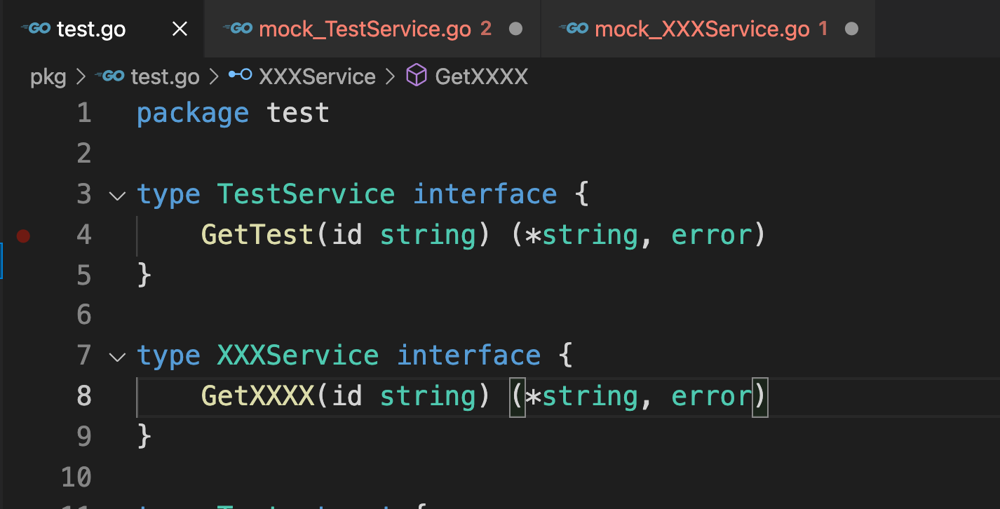

# go-lazy-mock README

lazy way to gen mock (Testify) without typing 

## Features

Generate mock file with mockery

## Requirements

you have to install mockery

https://github.com/vektra/mockery.git

