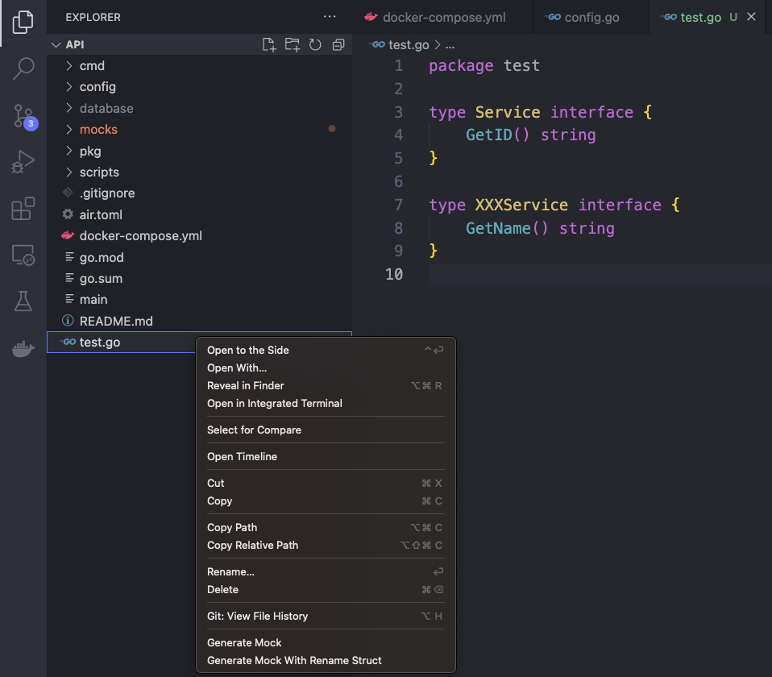
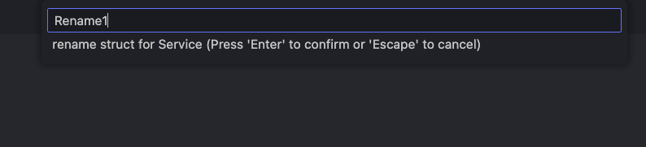
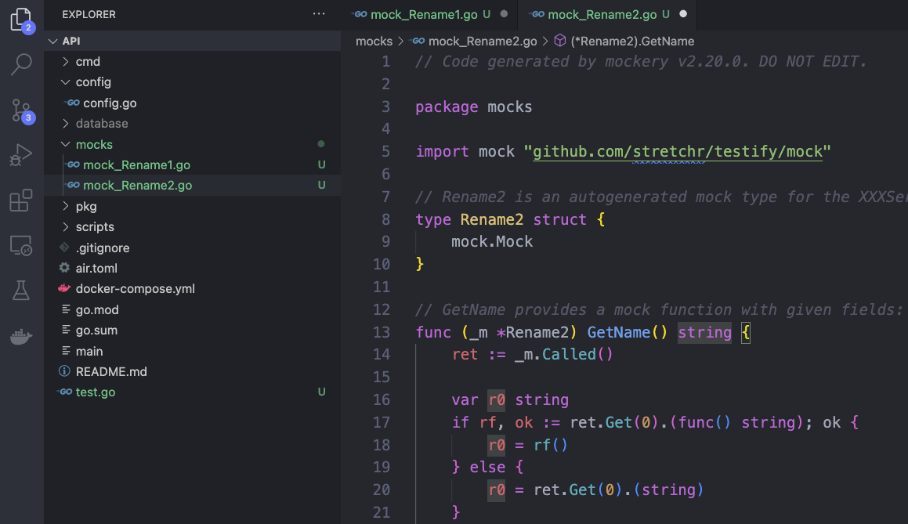

# Go Mock README

## Features
Generate mock file with mockery.

Lazy way to gen mock (Testify) without typing.


## Requirements
you have to install mockery with repository

https://github.com/vektra/mockery.git

or 

```
brew install mockery
```

## new version update with rename struct








